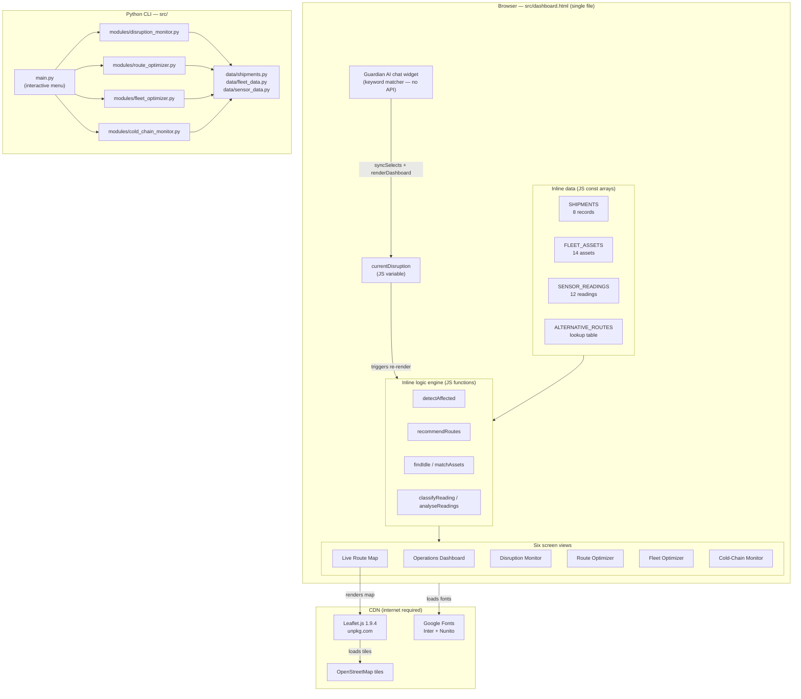
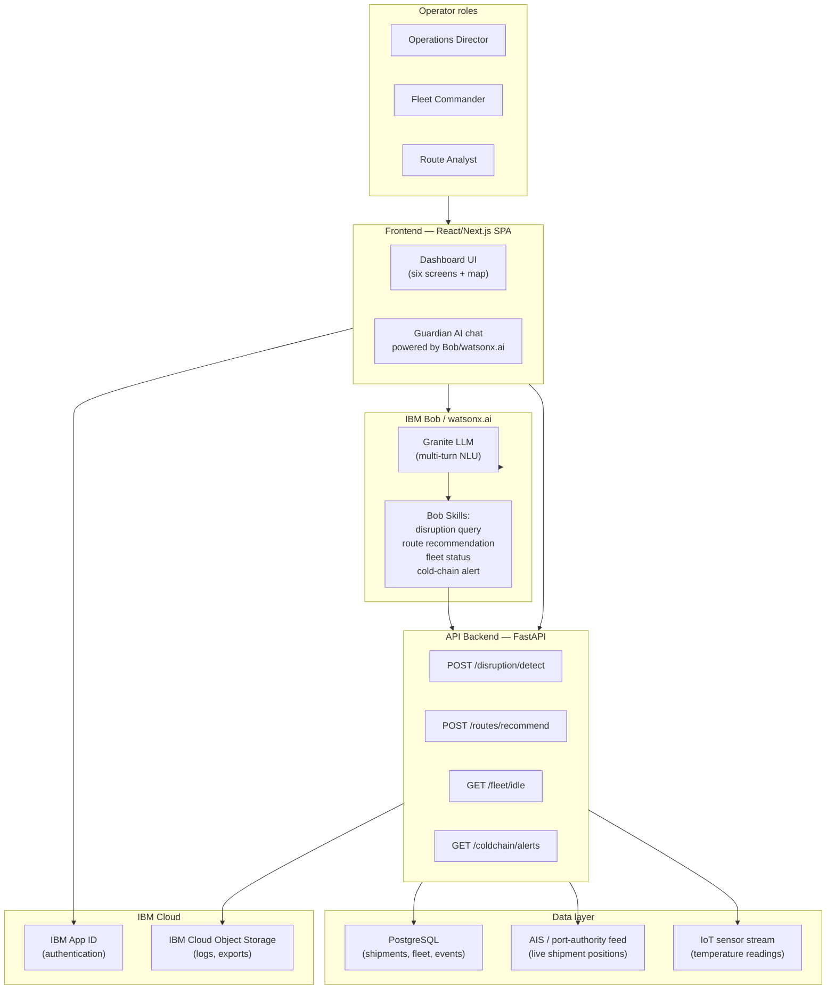
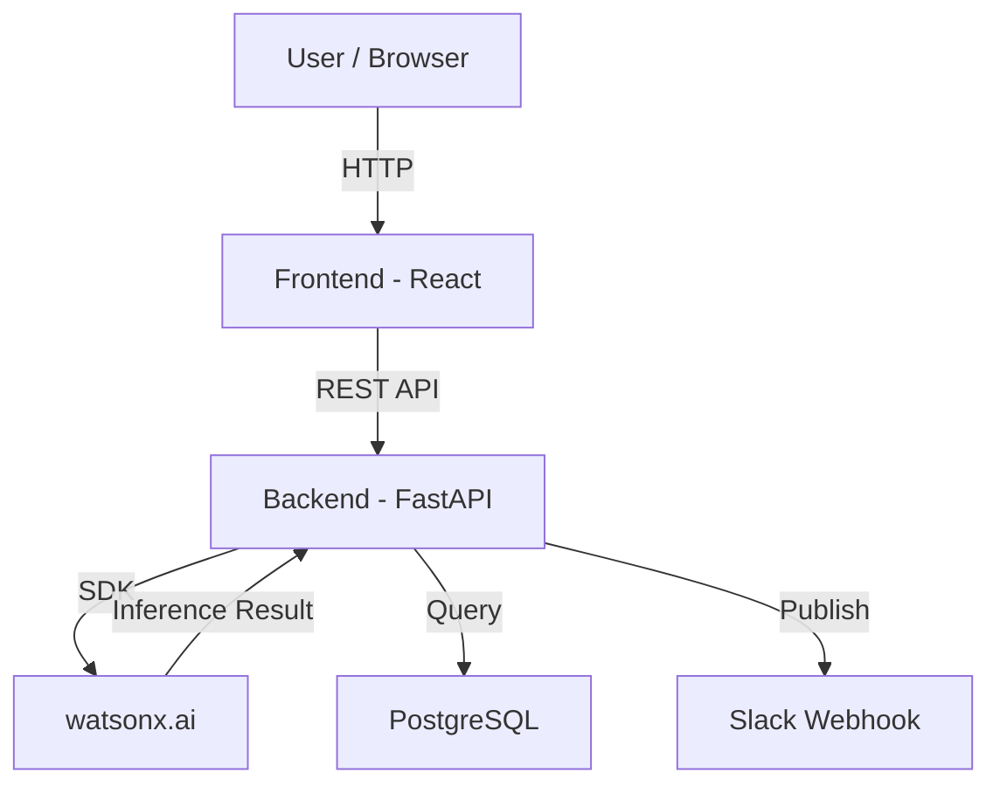

# Architecture

<<<<<<< HEAD
## Current Architecture (as built in `src/`)

Everything that exists today is described here — no aspirational components are
included in this section.

### Component table

| Component | Technology | Responsibility |
|---|---|---|
| **Dashboard UI** | HTML5 + CSS3 + Vanilla JavaScript | Single self-contained file (`src/dashboard.html`). Renders all six screens, the live map, and the chat widget. Contains its own copies of all data and all logic functions — no network calls at runtime beyond CDN assets. |
| **Inline data store (JS)** | JavaScript `const` arrays in `dashboard.html` | Holds `SHIPMENTS` (8 records, India-origin routes with lat/lon), `FLEET_ASSETS` (14 assets across 5 Indian ports/depots), `SENSOR_READINGS` (12 readings across 5 cargo types), and `ALTERNATIVE_ROUTES` lookup table. Exact mirror of the Python data files. |
| **Inline logic engine (JS)** | Vanilla JavaScript functions in `dashboard.html` | `detectAffected()`, `recommendRoutes()`, `findIdle()`, `matchAssets()`, `classifyReading()` / `analyseReadings()` / `getWorst()` — all re-run synchronously on every disruption-selector change. |
| **Live Route Map** | Leaflet.js 1.9.4 (CDN) + OpenStreetMap tiles | Renders shipping corridors, disruption zones, alternative route paths, and Indian port/depot markers. Driven by the same `currentDisruption` state variable as the rest of the dashboard. |
| **Guardian AI chat widget** | Vanilla JavaScript (`guardianAI()` in `dashboard.html`) | Keyword-based response engine (`q.match(/regex/)` dispatch). Reads live computed state. No external API. Can also switch `currentDisruption` via chat command, triggering a full dashboard re-render. |
| **Python CLI** | Python 3, stdlib only | `src/main.py` — interactive menu that calls the same four module functions as the JS engine. No web server, no third-party packages. |
| **Disruption Monitor** | `src/modules/disruption_monitor.py` | `detect_affected_shipments()` — case-insensitive substring match of disruption location against each shipment's `route` field. |
| **Route Optimizer** | `src/modules/route_optimizer.py` | `recommend_routes()` — looks up `ALTERNATIVE_ROUTES[route][cargo_type]` then appends `[route]["all"]`. Cargo-type-specific options are always prepended. |
| **Fleet Optimizer** | `src/modules/fleet_optimizer.py` | `find_idle_assets()` + `match_assets_to_shipments()` — filters by `status == "Idle"` then `cargo_type ∈ suitable_for`. |
| **Cold-Chain Monitor** | `src/modules/cold_chain_monitor.py` | `classify_reading()` — three-tier classification using `WARNING_MARGIN = 3.0 °C`. |
| **Data layer (Python)** | Plain Python dicts/lists | `src/data/shipments.py`, `fleet_data.py`, `sensor_data.py` — no ORM, no database. |
| **Typography** | Inter + Nunito (Google Fonts CDN) | Loaded at page open; degrades gracefully to system-ui if offline. |

---

### Current architecture diagram

> **Key constraint visible in this diagram:** the browser path and the Python CLI
> path are **entirely independent executables** — they share no runtime state and
> make no calls to each other. The JS data arrays in `dashboard.html` are a
> manually maintained copy of the Python data files in `src/data/`. Keeping them
> in sync is a manual step.

---

## Planned Architecture — Full Bob Vision (Future Work)

This section describes what the platform *could* become with IBM watsonx.ai /
IBM Bob integration and a live data backend. **Nothing in this section exists in
`src/` today.**

### What changes

| Current | Planned |
|---|---|
| Guardian AI: JS keyword matcher, no API | Replaced by IBM watsonx.ai Granite LLM via Bob for multi-turn NLU |
| Data: hardcoded JS/Python arrays | Live feeds: AIS shipment tracking, port-authority APIs, IoT sensor streams |
| No backend | FastAPI (or similar) backend serving a REST API consumed by the dashboard |
| No persistence | Database (e.g. PostgreSQL) storing disruption history, fleet state, cold-chain logs |
| Login: cosmetic only | Real session management via IBM App ID or equivalent |
| Single-user file | Multi-user hosted web application |

### Planned architecture diagram

> **Note:** The Bob integration point is the `Guardian AI` chat widget — the
> planned upgrade replaces the current `guardianAI()` JS function with a call to
> a Bob skill endpoint that has access to live backend data and can maintain
> conversation context across turns. All other screens (Disruption Monitor, Route
> Optimizer, etc.) remain browser-rendered but consume live REST API responses
> instead of hardcoded arrays.
=======
## System Architecture

[Describe the overall architecture of your system. Replace the Mermaid diagram below with your actual architecture.]

## Components

| Component | Technology | Responsibility |
|---|---|---|
| Frontend | [e.g., React 18] | [e.g., Dashboard UI, user interaction] |
| Backend API | [e.g., FastAPI] | [e.g., Business logic, orchestration] |
| AI / ML | [e.g., watsonx.ai] | [e.g., Anomaly scoring, classification] |
| Database | [e.g., PostgreSQL] | [e.g., Storing pipeline events and scores] |
| Notifications | [e.g., Slack API] | [e.g., Alerting on threshold breaches] |

## Data Flow

[Describe how data moves through your system from input to output.]

1. [e.g., Pipeline logs are ingested via a webhook from GitHub Actions]
2. [e.g., Logs are preprocessed and chunked into 512-token segments]
3. [e.g., Each chunk is sent to the watsonx.ai inference endpoint]
4. [e.g., Anomaly scores are stored in PostgreSQL]
5. [e.g., The React dashboard polls the API every 30 seconds to refresh]

## Security Considerations

[Note any security decisions relevant to the architecture — even if basic.]

- [e.g., API keys stored in environment variables, never committed to git]
- [e.g., All API routes require a Bearer token]
- [e.g., Database credentials rotated via IBM Secrets Manager]

## Scalability Notes

[Optional: how would this scale beyond the hackathon prototype?]

[e.g., "The FastAPI backend is stateless and could be horizontally scaled behind a load balancer. The watsonx.ai calls are the bottleneck and would benefit from request batching."]
>>>>>>> c3a8fc07675e73485e50b13f34188f3c772b2ef0
